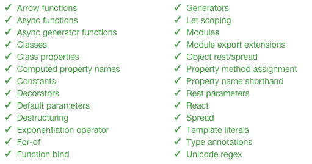
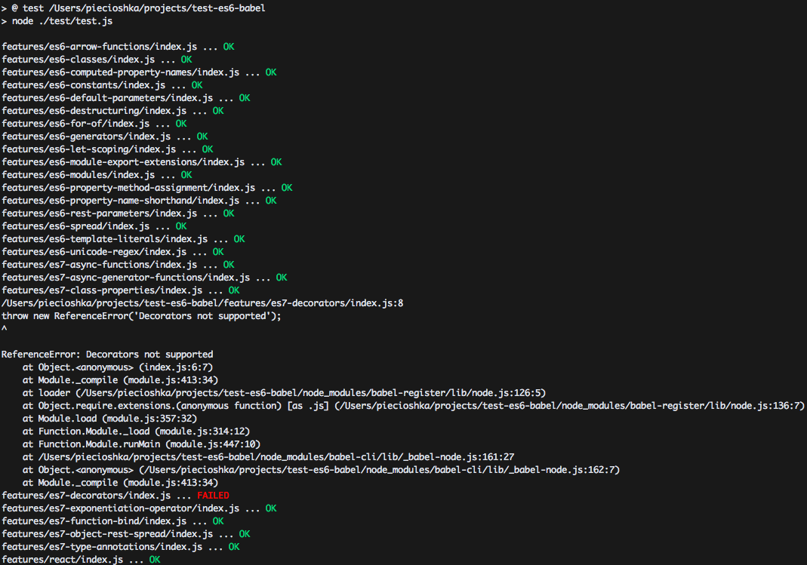

# test-es6-babel

> Testing opportunities which we have using [Babel.js](https://babeljs.io/). 


## Test

You try to run test by command:

```
npm install
npm test
```

## Details

On homepage we have list of features which [Babel.js](https://babeljs.io/) supports:

Left column:

* ES6 Arrow functions
* ES7 Async functions
* ES7 Async generator functions
* ES6 Classes
* ES7 Class properties
* ES6 Computed property names
* ES6 Constants
* ES7 Decorators - NOT SUPPORTED
* ES6 Default parameters
* ES6 Destructuring
* ES7 Exponentiation operator
* ES6 For-of
* ES7 Function bind

Right column:

* ES6 Generators
* ES6 Let scoping
* ES6 Modules
* ES6 Module export extensions
* ES6 Object rest/spread
* ES6 Property method assignment
* ES6 Property name shorthand
* ES6 Rest parameters
* React
* ES6 Spread
* ES6 Template literals
* ES7 Type annotations
* ES6 Unicode regex

Below you can see real screen from [Babel.js](https://babeljs.io/):



## Current status



Only `decorators` doesn't work.
