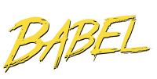

# test-babel

Projekt ma na celu przetestowanie wszystkich możliwości jakie daje nam transpiler [Babel.js](https://babeljs.io/).

## Szczegóły

Na stronie głównej jest wyszczególniona lista wszystkich rzeczy które wspiera Babel.js:

 - Array comprehensions
 - Arrow functions
 - Async functions
 - Async generator functions
 - Classes
 - Class properties
 - Computed property names
 - Constants
 - Decorators
 - Default parameters
 - Destructuring
 - Exponentiation operator
 - For-of
 - Function bind
 - Generators
 - Generator comprehensions
 - Let scoping
 - Modules
 - Module export extensions
 - Object rest/spread
 - Property method assignment
 - Property name shorthand
 - Rest parameters
 - React
 - Spread
 - Template literals
 - Type annotations
 - Unicode regex

Poznajmy wszystkie te zagadnienia!
